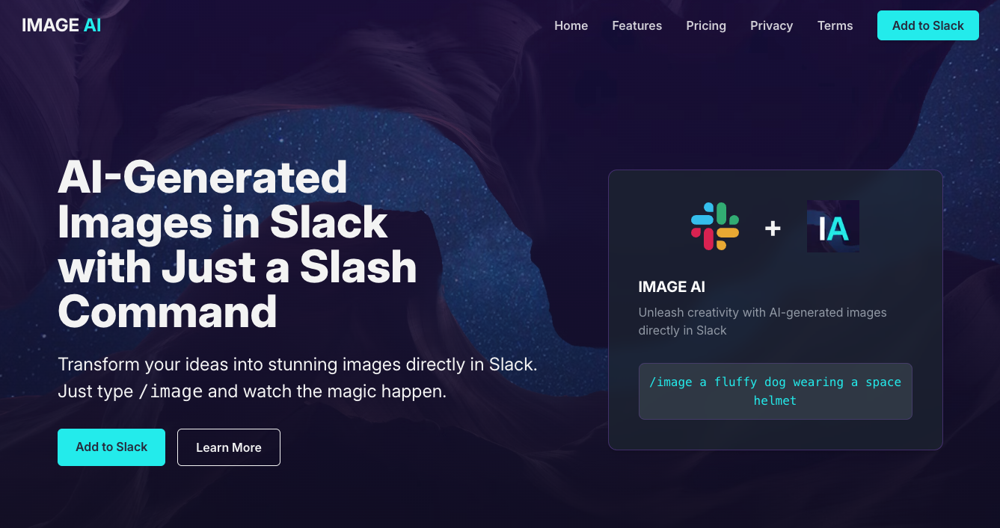

# Image AI Frontend

## Overview

This is the frontend application for Image AI, built using [Next.js](https://nextjs.org/) and [TypeScript](https://www.typescriptlang.org/). This application is designed to inform users about the Image AI Slack application that I have built project [here](https://github.com/lauraz-15/image-ai-backend), which allows them to generate images within Slack conversations using a simple `/image` command.

The frontend provides users with the ability to:

- **Install the Slack App:** Guide users through the process of adding the Image AI application to their Slack workspace.
- **Select a Plan:** Display available subscription plans with their features and pricing.
- **Buy Subscription:** Facilitate the purchase of a selected subscription plan.
- **Cancel Subscription:** Allow users to manage and cancel their existing subscriptions.
- **Read About Policies:** Provide access to important information such as privacy policies and terms of service.

## Tech Stack Used

- **[Next.js](https://nextjs.org/):** A React framework for building server-rendered and statically generated web applications.
- **[TypeScript](https://www.typescriptlang.org/):** A statically typed superset of JavaScript that adds optional types, classes, and interfaces.
- **[Stripe](https://stripe.com/):** A platform used for handling payments and subscriptions within the application.

## Deployed Project

You can view the live application at: [https://www.imageai-slack.com/](https://www.imageai-slack.com/)
